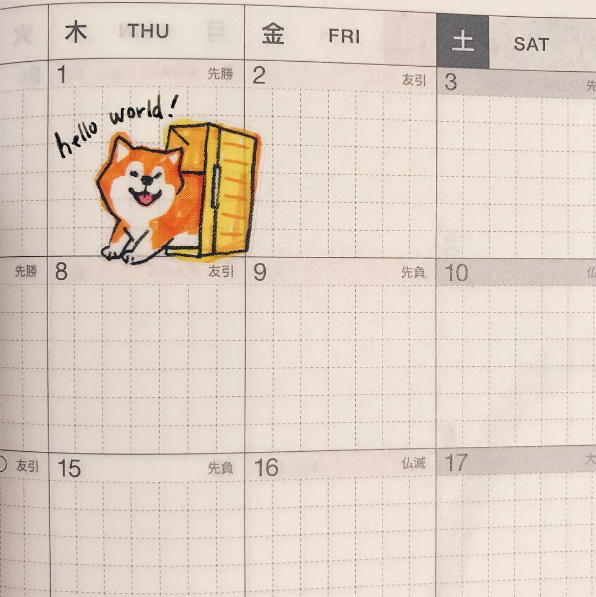

#### Hello!
I'm Nadine. I'm a designer experienced with owning UX design and UX research techniques to explore and bring ideas from early concept to finished, validated feature.  

I graduated from the University of Washington (B.S. Computer Science, M.S. Human Centered Design &amp; Engineering).

I design, write speculative fiction, take pictures, draw, play with my dog, study Japanese, and a lot of other things. I read a lot (recently, Charles Yu's <em>Interior Chinatown</em> and the entire <em>Animorphs</em> series).

I also love video games (recently, <em>Banjo-Kazooie</em>, though I'm extremely very looking forward to the next Splatoon!!!).

  In general, I enjoy buildings things that are not just fun, but do good by providing a service for people in their everyday lives.

(The font used in the headers of this website is <a href="https://www.behance.net/gallery/96690897/Maragsa-a-display-typeface-FREE">Maragsâ Display by John David Maza</a>.)
